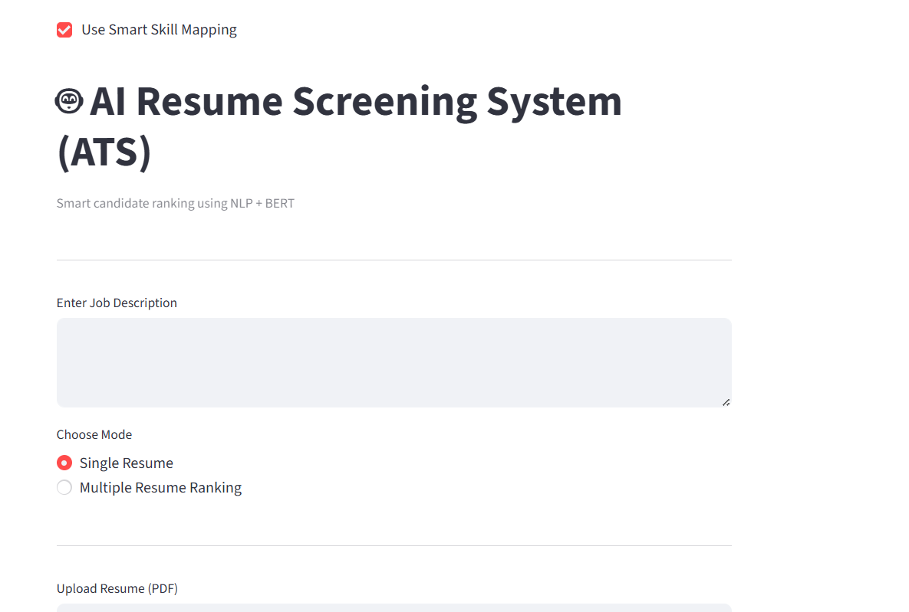
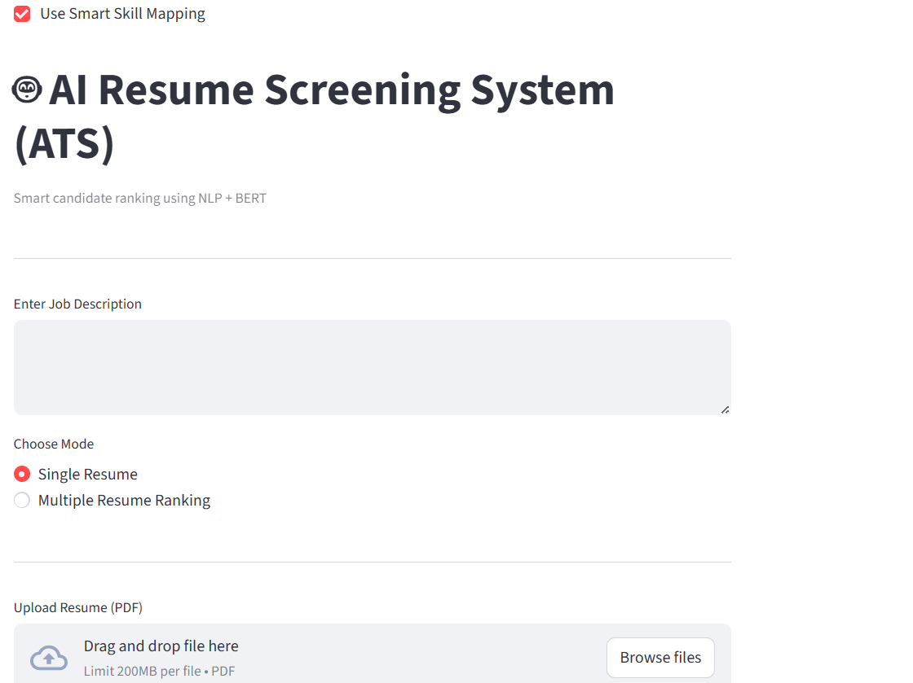
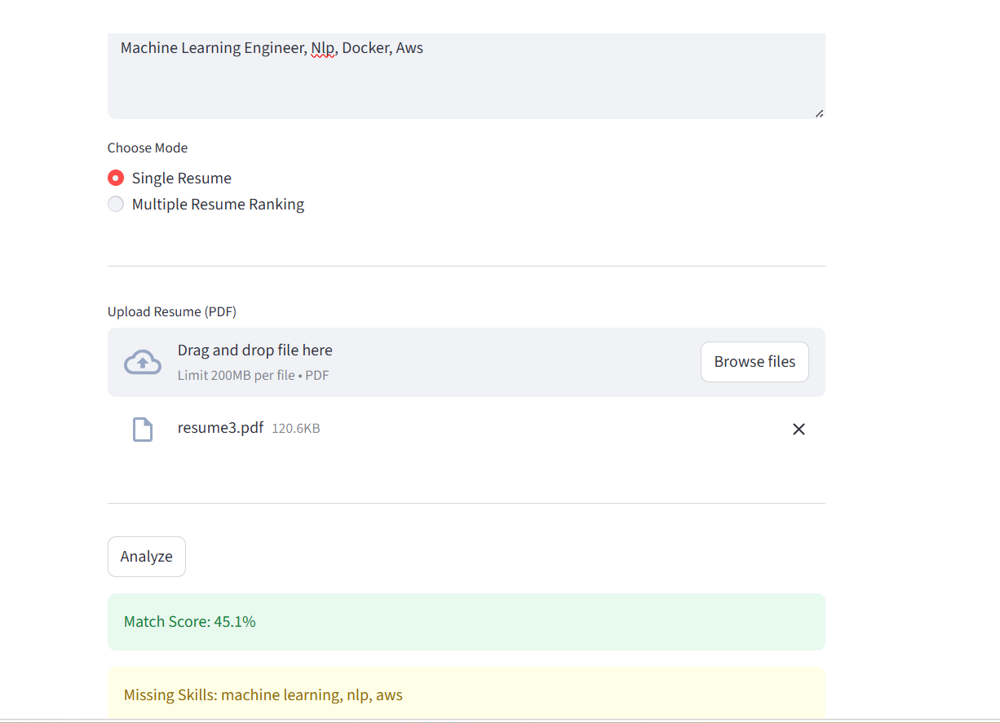
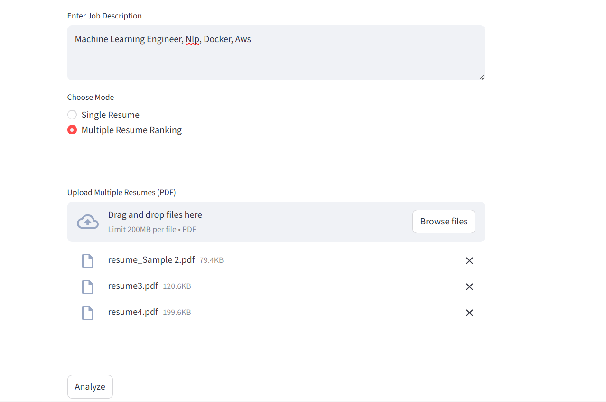
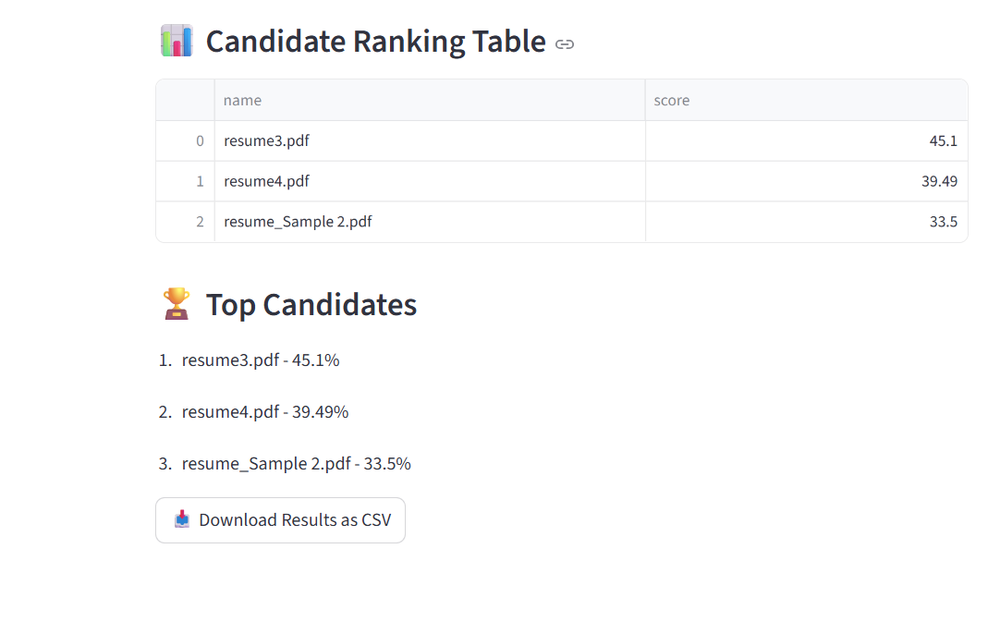
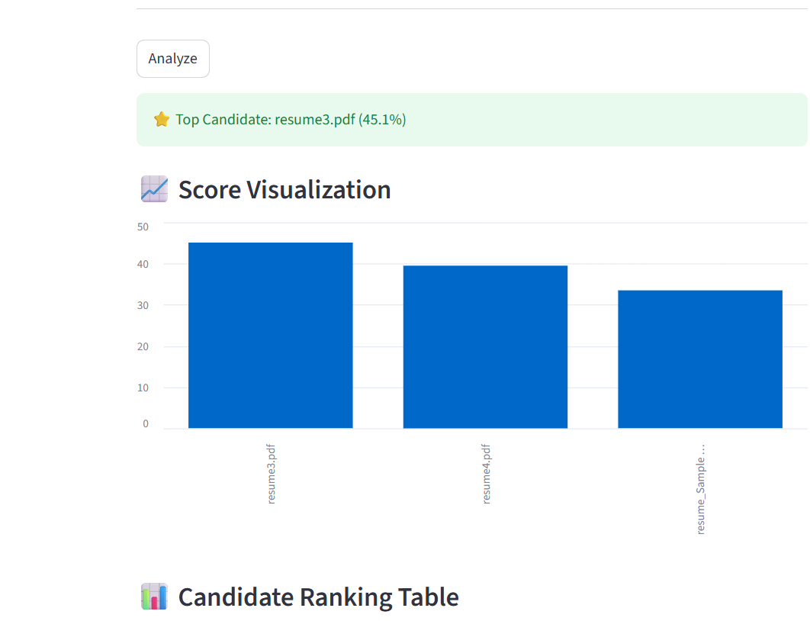

# AI-Resume-Screening-System
AI-powered Resume Screening System using BERT and NLP to match resumes with job descriptions, analyze skill gaps, and rank candidates via an interactive Streamlit Dashboard.
# AI Resume Screening System 🚀

## 📌 Overview

This project is an AI-powered Resume Screening System that helps recruiters analyze resumes and rank candidates based on job descriptions.

## 🧪 Model Development

The model was initially developed and tested using structured datasets in Jupyter Notebook (see `Resumenlp.ipynb`), and later integrated into a Streamlit application for real-world usage.

## 🎯 Features

* Resume vs Job Description Matching
* Semantic Similarity using BERT
* Skill Gap Analysis (Missing Skills)
* Smart Skill Mapping (AI → ML → NLP)
* Multiple Resume Ranking System
* Recruiter Dashboard (Table + CSV Download)
* Visualization (Graphs)

## 🧠 Tech Stack

* Python
* Streamlit
* Sentence Transformers (BERT)
* Pandas
* PDFPlumber

## ⚙️ How it Works

1. Extract text from resume PDF
2. Convert text into embeddings using BERT
3. Compute similarity score
4. Extract skills and find missing skills
5. Rank candidates
6. Display results in dashboard

## ▶️ Run the Project

```bash
pip install -r requirements.txt
streamlit run app.py
```

## 📸 Screenshots

### 🏠 Home Screen


### 📄 Single Resume Analysis



### 📊 Multiple Resume Ranking



### 📈 Visualization

## 📊 Output Example

* Match Score: 71%
* Missing Skills: AWS, Docker
* Top Candidates Ranking


## 📊 Evaluation

The system was tested on sample resume-job pairs.
Typical similarity scores ranged between 60%–70% for relevant matches and lower for unrelated profiles.

## ❓ Why SBERT?

- Captures semantic meaning (context-aware)
- Better than TF-IDF (keyword-based)
- Works well for sentence similarity tasks

## ⚠️ Limitations

- PDF parsing may lose formatting
- Skill extraction is keyword-based
- Model performance may vary on real-world resumes
- Does not handle bias or fairness explicitly

## 📂 Sample Data
Sample resumes are included in the `sample_resumes` folder for testing.

## 💡 Future Improvements

* Knowledge Graph Integration
* Resume Parsing using NLP models
* Cloud Deployment

---
